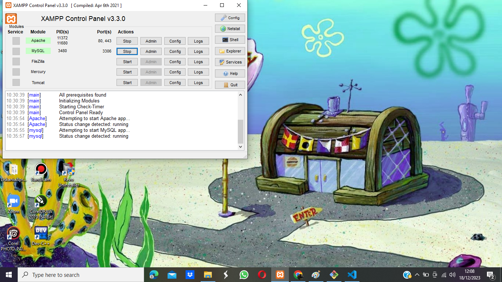
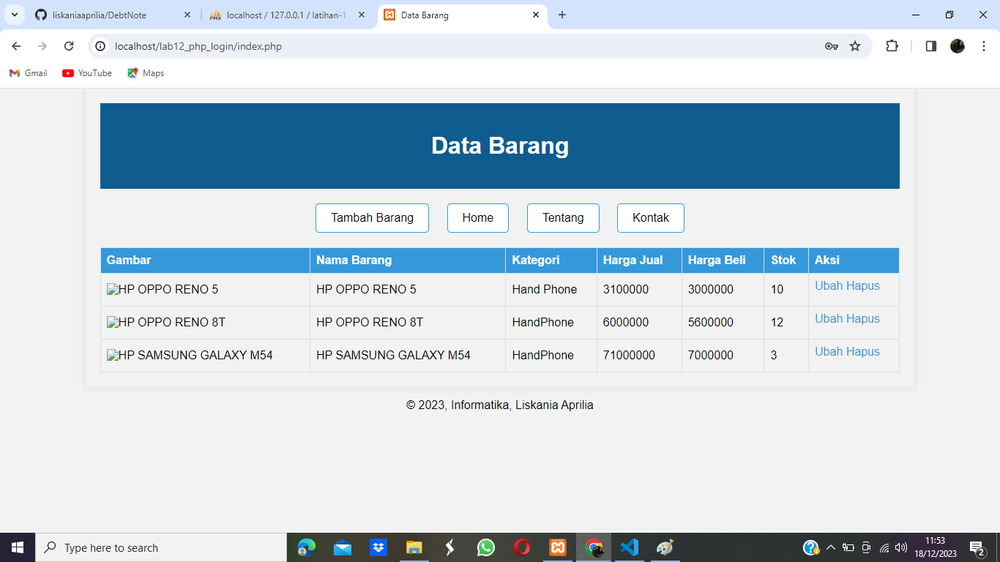
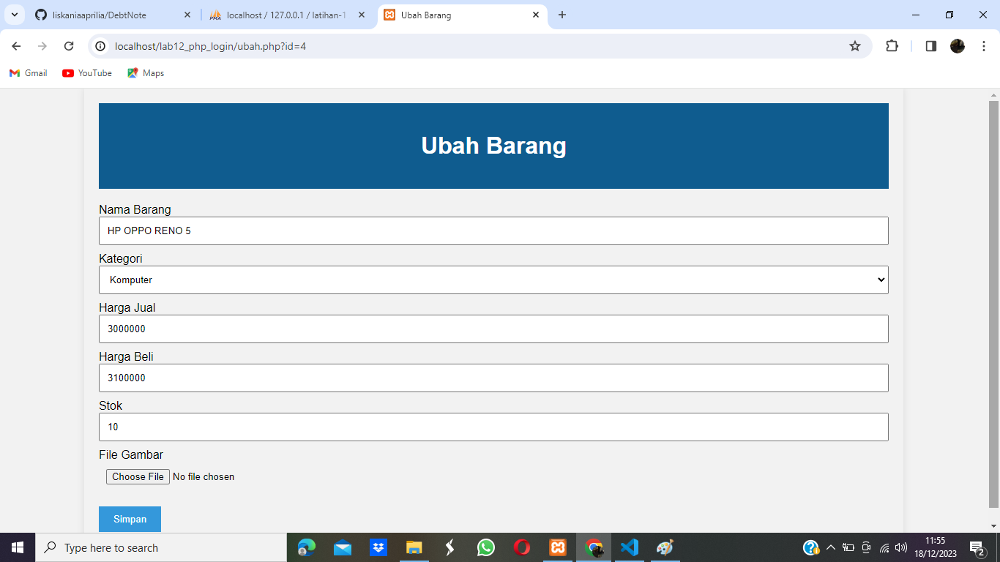
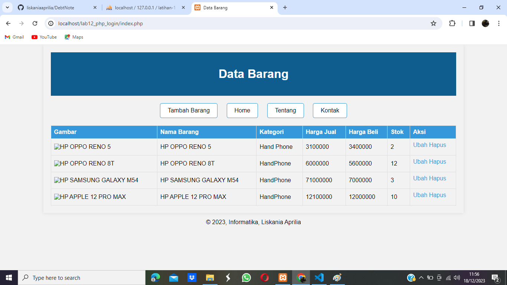
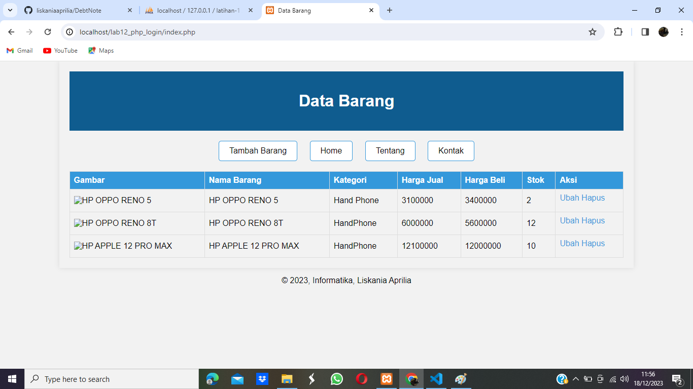
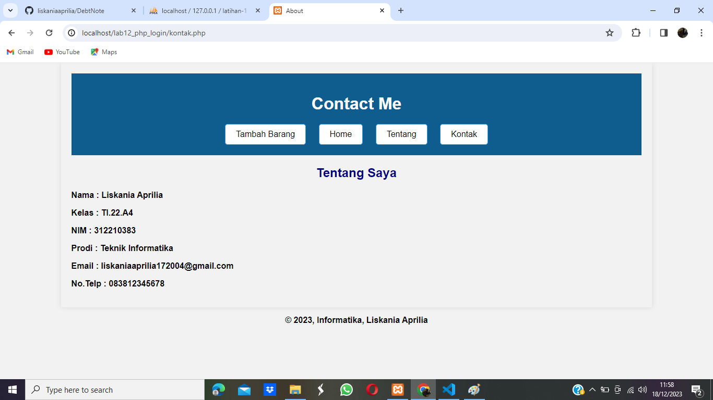
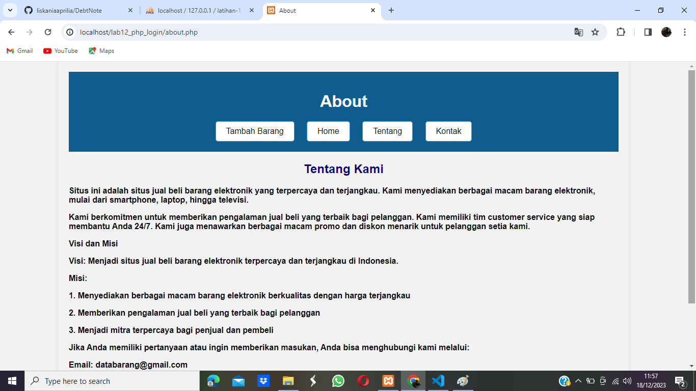

# PHP (Hypertext Preprocessor)

PHP Object-Oriented Programming (OOP) adalah paradigma pemrograman yang memungkinkan pengembangan perangkat lunak dengan menggunakan konsep-konsep seperti kelas, objek, pewarisan (inheritance), enkapsulasi, dan polimorfisme. OOP membantu dalam mengorganisir dan memahami kode dengan cara yang lebih modular dan terstruktur.

## 1. Mysql Server

Untuk menjalankan MySQL Server dari menu XAMPP Contol.



## 2. Membuat Database: Login

```PHP
CREATE TABLE `user`(
`id` INT NOT NULL AUTO_INCREMENT,
`username` VARCHAR(50),
`password` VARCHAR(50),
PRIMARY KEY (`id`),
UNIQUE INDEX `UNIQUE` (`username`)
) ENGINE=MYISAM;
```

## 3. Menambahkan Data

```PHP
INSERT INTO `user` (`username`, `password`) VALUES ('admin', md5('admin'));
```

## 4. Membuat file login_session.php
Deskripsi: dignakan untuk pengecekan sesi login, file ini nantinya akan di include di setiap halaman yang membutuhkan login.

```PHP
<?php

session_start();

if (!isset($_SESSION['isLogin']))
    header('location: login.php');

?>
```

# OUTPUT

Buat folder lab12_php_login pada root directory web server, Kemudian untuk mengakses direktory tersebut pada web server dengan mengakses URL: http://localhost/lab12_php_login/

## 1. Membuat file index untuk menampilkan data (Read)



## 2. Menambah Data (Create)


## 3. Mengubah Data (Update)





## 4. Menghapus Data (Delete)



## 5. Menampilkan Home



## 6. Menampilkan About



## 7. Menampilkan Contact


# FINISH